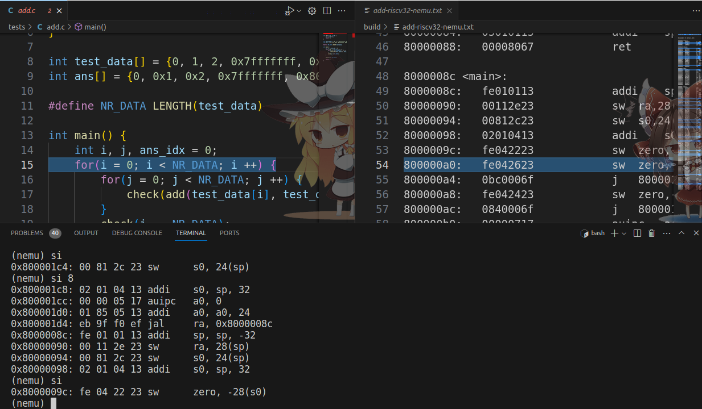
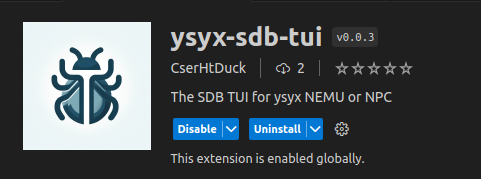
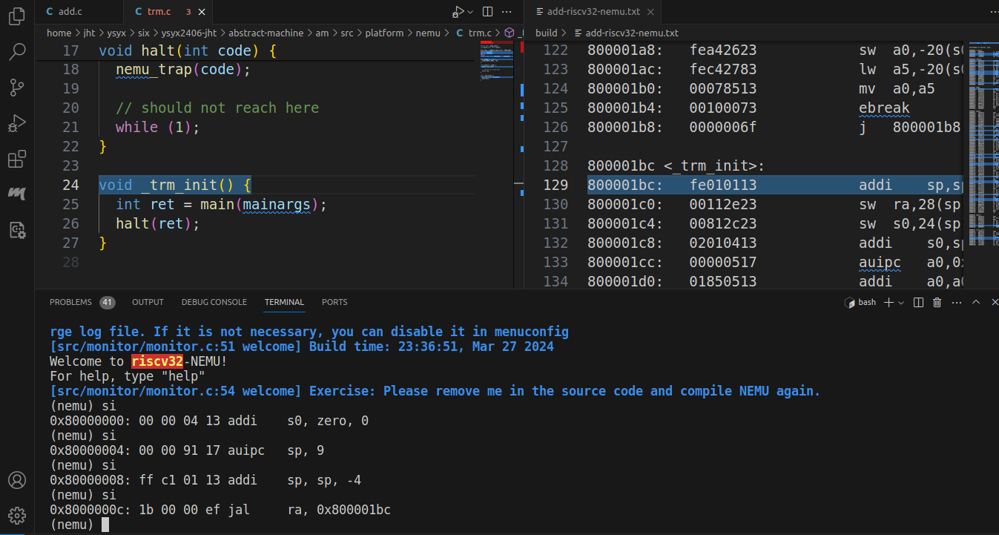

# ysyx-sdb-tui-client
A simple c++ `socket.io` client for communicating with `ysyx-sdb-tui` server.

> You can install `ysyx-sdb-tui` plugin in the marketplace of VS Code. Or see [ysyx-sdb-tui](https://github.com/CSerht/ysyx-sdb-tui-plugin)

<p align="center">
  
</p>

When you use sdb in NEMU or NPC for debugging, it can highlight the specific line in the disassembly file and source file. It greatly enhances debugging efficiency.

## Dependencies

- `apt install gdb-multiarch`: support RISC-V debugging
- Install C++ `socket.io` client library: [socket.io-client-cpp](https://github.com/socketio/socket.io-client-cpp?tab=readme-ov-file), see Chapter **Installation alternatives** for details.

## Interface configuration

### NEMU
1. copy `sdb-client.cc` to `${NEMU_HOME}/src/utils`.

2. Modify the `filelist.mk` in `${NEMU_HOME}/src/utils`. Add `sdb-client.cc`, `-lsioclient` to specific conditions.

```makefile
ifneq ($(CONFIG_ITRACE)$(CONFIG_IQUEUE),)
CXXSRC = src/utils/disasm.cc src/utils/sdb-client.cc
CXXFLAGS += $(shell llvm-config --cxxflags) -fPIE 
LIBS += $(shell llvm-config --libs) -lsioclient
endif
```

3. Add interface callings to NEMU.

- Add client initialization code to the function `void init_monitor(int argc, char *argv[])` in `src/monitor/monitor.c`.

```c
  /* Initialize the simple debugger. */
  init_sdb();

  /* Initialize the sdb client, server is vscode plugin */
  void open_sdb_client();
  void init_sdb_vscode_file(char *img_file_path, int type);
  void highlight_line(word_t addr, int type);
  if (img_file != NULL)
  {
    open_sdb_client();
    init_sdb_vscode_file(img_file, 0);
    init_sdb_vscode_file(img_file, 1);
    highlight_line(cpu.pc, 0); // disassembly file, highlight the start pc
  }
  ///////////////////////////////////////////////////////////
```

- Add `highlight_line()` to the function `execute` in `src/cpu/cpu-exec.c`.

```c
static void execute(uint64_t n)
{
    Decode s;
    for (; n > 0; n--)
    {
        exec_once(&s, cpu.pc);
        // ...
    }

   
    /* highlight the specified line in the source file and disassembly file */
    void highlight_line(word_t addr, int type);
    highlight_line(s.dnpc, 2); // all
}
```

- Add `close_sdb_client` to function `cpu_exec` in `src/cpu/cou-exec.c`.

```c
case NEMU_QUIT:
    Log("NEMU QUIT Only");

    ///////////////////////////////////////
    void close_sdb_client();
    close_sdb_client();
    ///////////////////////////////////////

    statistic();
}
```

### AM

In `abstract-machine/Makfile`:

```makefile
# modify `O2` to `O0`
CFLAGS += O0 -ggdb 
```

Then **clean all** `build` directory and **rebuild**:

- `abstract-machine/build` directory
- `abstract-machine/am/build` directory
- `abstract-machine/klib/build` directory

## User Guide

1. Open VS Code and install the `ysyx-sdb-tui` plugin in the marketplace.

<p align="center">
  
</p>

2. Type `Ctrl+Shift+P` to open the command palette.
    - Type `ysyx sdb tui Enable` and press `Enter` to enable the extension. It will open a terminal and focus on it.
    
3. Run the NEMU program in sdb mode in the terminal, such as `make ARCH=riscv32-nemu run`.

4. Type `si 5` test the SDB TUI plugin.

<p align="center">
  
</p>

5. Close the server after debugging.
    - Type `ysyx sdb tui Disable` and press `Enter` to disable the extension.
    - Or close the VS Code directly.